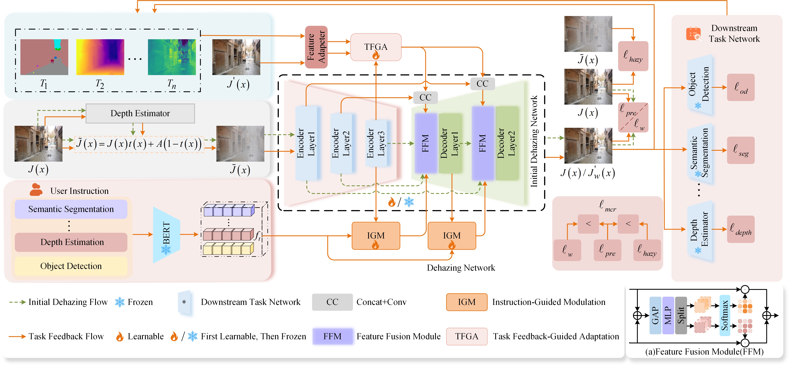

# <p align=center> ADeT-Net:Adaptive Dynamic Dehazing via Instruction-Driven and Task-Feedback Closed-Loop Optimization for Diverse Downstream Task Adaptation</p>

## Pipeline




## Installation
1. Clone the repository.
    ```bash
    The link will be announced soon.
    ```

2. Install PyTorch 1.8.0 and torchvision 0.9.0.
    ```bash
    conda install -c pytorch pytorch torchvision
    ```

3. Install the other dependencies.
    ```bash
    pip install -r requirements.txt
    ```

## Prepare
- **ADE20K** can be downloaded from [here.](https://ade20k.csail.mit.edu/)
- **COCO** can be downloaded from [here.](http://cocodataset.org)
- **KITTI** can be downloaded from [here.](https://www.cvlibs.net/datasets/kitti/)
## Training

`configs`

After adjusting the settings, use the following script to initiate the training of the model:

```
CUDA_VISIBLE_DEVICES=X python train.py
```

For example：

```
CUDA_VISIBLE_DEVICES=0 python train.py
```

## Evaluation

Run the following script to evaluate the trained model with a single GPU.


```sh
CUDA_VISIBLE_DEVICES=X python test.py
```

For example：

```sh
CUDA_VISIBLE_DEVICES=0 python test.py
```


# Contact:

